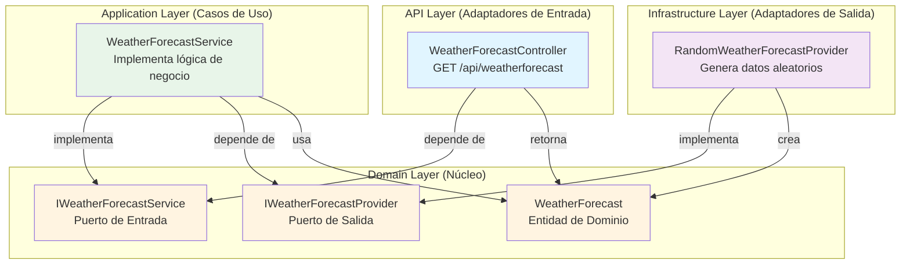
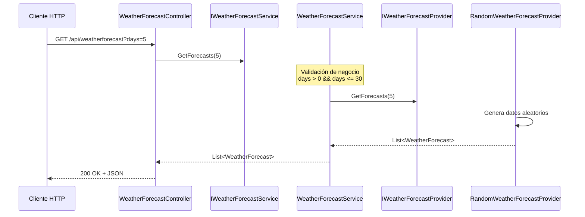

# Arquitectura Hexagonal - Diagrama de Capas



## Flujo de una Petición



## Principios SOLID Aplicados

### 1. Single Responsibility Principle (SRP)
- **WeatherForecastController**: Solo maneja peticiones HTTP
- **WeatherForecastService**: Solo contiene lógica de negocio
- **RandomWeatherForecastProvider**: Solo genera/obtiene datos

### 2. Open/Closed Principle (OCP)
- Podemos agregar nuevos proveedores sin modificar el servicio
- Podemos agregar nuevos controladores (GraphQL, gRPC) sin modificar el dominio

### 3. Liskov Substitution Principle (LSP)
- Cualquier implementación de `IWeatherForecastProvider` puede sustituir a otra
- `RandomWeatherForecastProvider` podría ser reemplazado por `DatabaseWeatherForecastProvider`

### 4. Interface Segregation Principle (ISP)
- Interfaces pequeñas y específicas (`IWeatherForecastService`, `IWeatherForecastProvider`)
- Cada interfaz tiene un propósito único

### 5. Dependency Inversion Principle (DIP)
- Las capas de alto nivel (Application) no dependen de las de bajo nivel (Infrastructure)
- Ambas dependen de abstracciones (interfaces en Domain)

## Ventajas de esta Arquitectura

| Aspecto | Beneficio |
|---------|-----------|
| **Testabilidad** | Fácil crear mocks de las interfaces |
| **Mantenibilidad** | Cambios aislados en cada capa |
| **Escalabilidad** | Agregar funcionalidad sin romper lo existente |
| **Independencia** | El dominio no conoce detalles de infraestructura |
| **Flexibilidad** | Cambiar tecnologías sin afectar la lógica de negocio |

## Ejemplo de Extensión: Agregar Base de Datos

```csharp
// 1. Crear nueva implementación del puerto de salida
public class DatabaseWeatherForecastProvider : IWeatherForecastProvider
{
    private readonly ApplicationDbContext _context;
    
    public DatabaseWeatherForecastProvider(ApplicationDbContext context)
    {
        _context = context;
    }
    
    public IEnumerable<WeatherForecast> GetForecasts(int days)
    {
        return _context.WeatherForecasts
            .Where(w => w.Date >= DateOnly.FromDateTime(DateTime.Now))
            .Take(days)
            .ToList();
    }
}

// 2. Cambiar el registro en Program.cs
builder.Services.AddScoped<IWeatherForecastProvider, DatabaseWeatherForecastProvider>();

// ¡El resto del código no necesita cambios!
```

## Ejemplo de Extensión: Agregar GraphQL

```csharp
// 1. Crear nuevo adaptador de entrada
public class WeatherForecastQuery
{
    private readonly IWeatherForecastService _service;
    
    public WeatherForecastQuery(IWeatherForecastService service)
    {
        _service = service;
    }
    
    public IEnumerable<WeatherForecast> GetForecasts(int days)
    {
        return _service.GetForecasts(days);
    }
}

// 2. Registrar GraphQL en Program.cs
builder.Services.AddGraphQLServer()
    .AddQueryType<WeatherForecastQuery>();

// ¡La lógica de negocio se reutiliza sin cambios!
```
