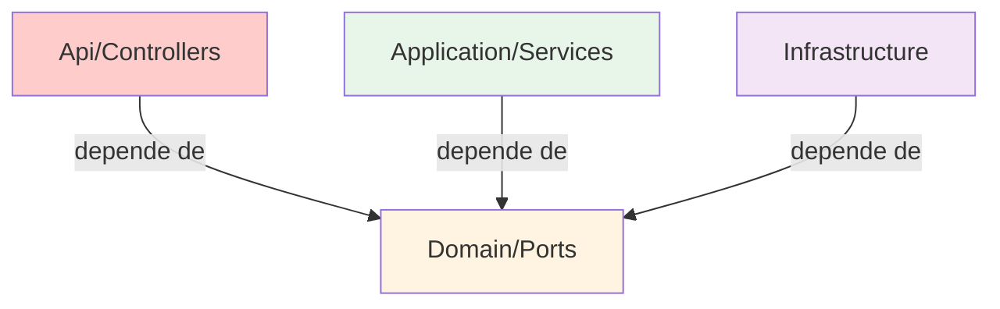
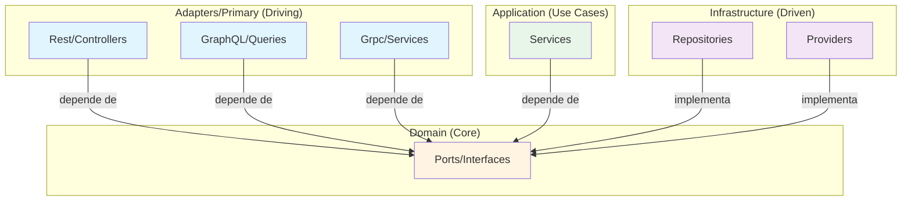

# 🔄 Comparación: Antes vs Después

## Estructura de Carpetas

### ❌ ANTES (Incorrecto)

```
AspNetProject/
├── Api/                    ❌ Nombre demasiado específico
│   └── Controllers/        ❌ ¿Dónde va GraphQL? ¿gRPC?
│       └── WeatherForecastController.cs
├── Domain/
│   ├── Models/
│   └── Ports/
├── Application/
│   └── Services/
└── Infrastructure/
    ├── Data/
    ├── Providers/
    └── Repositories/
```

**Problemas:**
- ❌ "Api" solo representa REST/HTTP
- ❌ No hay lugar claro para otros adaptadores primarios
- ❌ No sigue el estándar de arquitectura hexagonal
- ❌ Inconsistente con ejemplos de Java y otros lenguajes

---

### ✅ DESPUÉS (Correcto)

```
AspNetProject/
├── Adapters/                           ✅ Nombre genérico y correcto
│   ├── Primary/                        ✅ Adaptadores de entrada (Driving)
│   │   ├── Rest/                       ✅ REST/HTTP
│   │   │   └── Controllers/
│   │   │       └── WeatherForecastController.cs
│   │   ├── GraphQL/                    ✅ Espacio para GraphQL
│   │   │   └── Queries/
│   │   ├── Grpc/                       ✅ Espacio para gRPC
│   │   │   └── Services/
│   │   └── Cli/                        ✅ Espacio para CLI
│   │       └── Commands/
│   ├── Secondary/                      ✅ Adaptadores de salida (Driven)
│   │   └── (opcional)
│   └── README.md                       ✅ Documentación
├── Domain/                             ✅ Núcleo sin cambios
│   ├── Models/
│   │   ├── City.cs
│   │   ├── IEntity.cs
│   │   └── WeatherForecast.cs
│   └── Ports/
│       ├── IRepository.cs
│       ├── IWeatherForecastProvider.cs
│       └── IWeatherForecastService.cs
├── Application/                        ✅ Casos de uso sin cambios
│   └── Services/
│       └── WeatherForecastService.cs
└── Infrastructure/                     ✅ Adaptadores secundarios
    ├── Data/
    │   ├── ApplicationDbContext.cs
    │   └── Configurations/
    ├── Providers/
    │   └── RandomWeatherForecastProvider.cs
    └── Repositories/
        ├── EfRepository.cs
        └── CityRepository.cs
```

**Ventajas:**
- ✅ Sigue el estándar de arquitectura hexagonal
- ✅ Escalable para múltiples tipos de adaptadores
- ✅ Clara separación Primary (driving) vs Secondary (driven)
- ✅ Consistente con la literatura y ejemplos de la industria

---

## Flujo de Dependencias

### ❌ ANTES



**Problema**: No queda claro que "Api" es solo uno de varios posibles adaptadores primarios.

---

### ✅ DESPUÉS



**Ventaja**: Queda claro que hay múltiples adaptadores primarios, todos al mismo nivel.

---

## Namespaces

### ❌ ANTES

```csharp
// Api/Controllers/WeatherForecastController.cs
namespace AspNetProject.Api.Controllers;

[ApiController]
[Route("api/[controller]")]
public class WeatherForecastController : ControllerBase
{
    // ...
}
```

**Problema**: El namespace "Api" no indica que es un adaptador primario.

---

### ✅ DESPUÉS

```csharp
// Adapters/Primary/Rest/Controllers/WeatherForecastController.cs
namespace AspNetProject.Adapters.Primary.Rest.Controllers;

[ApiController]
[Route("api/[controller]")]
public class WeatherForecastController : ControllerBase
{
    // ...
}
```

**Ventaja**: El namespace claramente indica:
- ✅ Es un **Adaptador**
- ✅ Es **Primario** (driving)
- ✅ Es de tipo **REST**
- ✅ Es un **Controller**

---

## Comparación con Java

### Estructura Típica en Java

```
src/main/java/com/example/
├── domain/              (o "core")
│   ├── model/
│   └── port/
├── application/
│   └── service/
├── infrastructure/
│   ├── persistence/
│   └── external/
└── adapters/
    ├── in/              (o "primary")
    │   ├── rest/
    │   ├── graphql/
    │   └── cli/
    └── out/             (o "secondary")
        ├── persistence/
        └── external/
```

### Nuestra Estructura en .NET (Ahora)

```
AspNetProject/
├── Domain/              ✅ Equivalente a "domain"
│   ├── Models/
│   └── Ports/
├── Application/         ✅ Equivalente a "application"
│   └── Services/
├── Infrastructure/      ✅ Equivalente a "infrastructure" + "adapters/out"
│   ├── Data/
│   ├── Providers/
│   └── Repositories/
└── Adapters/            ✅ Equivalente a "adapters"
    ├── Primary/         ✅ Equivalente a "in"
    │   ├── Rest/
    │   ├── GraphQL/
    │   └── Grpc/
    └── Secondary/       ✅ Equivalente a "out" (opcional)
```

**Resultado**: ✅ Ahora nuestra estructura es consistente con Java y otros lenguajes.

---

## Ejemplos de Extensión

### Agregar GraphQL

#### ❌ ANTES (Confuso)

```
¿Dónde pongo GraphQL?
├── Api/                 ❌ ¿Aquí? Pero se llama "Api"...
│   ├── Controllers/     ❌ ¿Junto a REST controllers?
│   └── GraphQL/         ❌ ¿Como subcarpeta de Api?
```

#### ✅ DESPUÉS (Claro)

```
Adapters/
└── Primary/             ✅ Claro: es un adaptador primario
    ├── Rest/            ✅ REST en su carpeta
    └── GraphQL/         ✅ GraphQL en su carpeta
        ├── Queries/
        ├── Mutations/
        └── Subscriptions/
```

---

### Agregar gRPC

#### ❌ ANTES (Confuso)

```
¿Dónde pongo gRPC?
├── Api/                 ❌ ¿Aquí? Pero gRPC no es REST...
│   ├── Controllers/
│   └── Grpc/            ❌ ¿Como subcarpeta de Api?
```

#### ✅ DESPUÉS (Claro)

```
Adapters/
└── Primary/             ✅ Claro: es un adaptador primario
    ├── Rest/            ✅ REST en su carpeta
    ├── GraphQL/         ✅ GraphQL en su carpeta
    └── Grpc/            ✅ gRPC en su carpeta
        └── Services/
```

---

## Tabla Comparativa

| Aspecto | ANTES (Api/) | DESPUÉS (Adapters/) |
|---------|--------------|---------------------|
| **Nombre** | ❌ Específico (solo REST) | ✅ Genérico (cualquier adaptador) |
| **Escalabilidad** | ❌ Limitada | ✅ Ilimitada |
| **Claridad** | ❌ Confusa | ✅ Clara |
| **Estándar** | ❌ No sigue hexagonal | ✅ Sigue hexagonal |
| **Consistencia** | ❌ Diferente a Java | ✅ Consistente con Java |
| **Documentación** | ❌ Escasa | ✅ Completa |
| **Futuro** | ❌ Requiere refactoring | ✅ Listo para crecer |

---

## Conceptos Clave

### Primary Adapters (Driving)

**¿Qué son?** Adaptadores que **conducen** la aplicación.

**Pregunta clave:** *"¿Quién usa mi aplicación?"*

**Ejemplos:**
- ✅ REST Controllers (HTTP)
- ✅ GraphQL Resolvers
- ✅ gRPC Services
- ✅ CLI Commands
- ✅ Message Queue Consumers
- ✅ WebSocket Handlers

**Ubicación:** `Adapters/Primary/`

---

### Secondary Adapters (Driven)

**¿Qué son?** Adaptadores que **son conducidos** por la aplicación.

**Pregunta clave:** *"¿Qué usa mi aplicación?"*

**Ejemplos:**
- ✅ Database Repositories
- ✅ HTTP Clients (APIs externas)
- ✅ Email Senders
- ✅ File Storage
- ✅ Cache Providers
- ✅ Message Queue Publishers

**Ubicación:** `Infrastructure/` (principalmente) o `Adapters/Secondary/`

---

## Regla de Oro

```
┌─────────────────────────────────────────────┐
│  Los adaptadores dependen del Domain       │
│  El Domain NUNCA depende de los adaptadores│
└─────────────────────────────────────────────┘
```

### ✅ Permitido

```csharp
// Adapters/Primary/Rest/Controllers/WeatherForecastController.cs
using AspNetProject.Domain.Ports;  // ✅ OK

public class WeatherForecastController
{
    private readonly IWeatherForecastService _service;  // ✅ OK: Puerto de Domain
}
```

### ❌ Prohibido

```csharp
// Domain/Ports/IWeatherForecastService.cs
using AspNetProject.Adapters.Primary.Rest;  // ❌ NUNCA

public interface IWeatherForecastService
{
    // El Domain NO debe conocer los adaptadores
}
```

---

## Conclusión

La refactorización de `Api/` a `Adapters/Primary/Rest/` no es solo un cambio de nombre:

✅ **Mejora la arquitectura** siguiendo el patrón hexagonal estándar  
✅ **Facilita la escalabilidad** para agregar nuevos adaptadores  
✅ **Clarifica la intención** separando Primary vs Secondary  
✅ **Mejora la consistencia** con la literatura y otros lenguajes  
✅ **Prepara el futuro** sin necesidad de refactorizar después  

**Resultado:** Un proyecto más profesional, mantenible y escalable. 🚀
