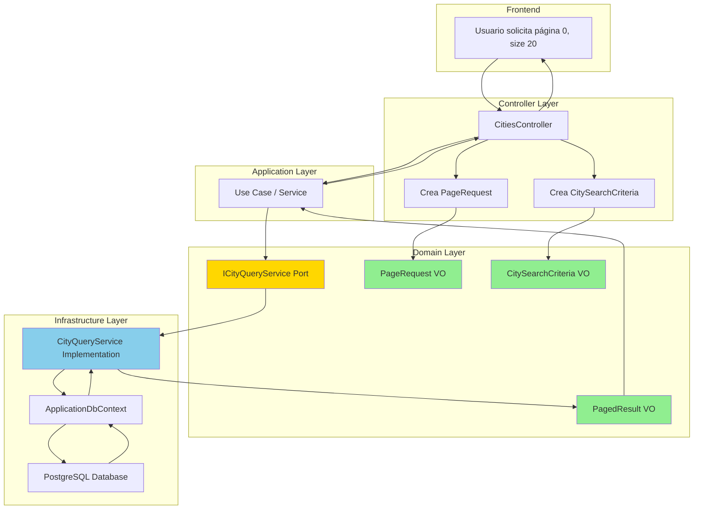

# Diagrama de Paginación: Spring Boot vs .NET

## 🔄 Flujo de Paginación



## 📊 Comparación Visual: Spring Boot vs .NET

```
┌─────────────────────────────────────────────────────────────────────┐
│                         SPRING BOOT                                 │
├─────────────────────────────────────────────────────────────────────┤
│                                                                     │
│  Controller                                                         │
│  ┌────────────────────────────────────────────────────────────┐   │
│  │ @GetMapping("/cities")                                     │   │
│  │ Page<City> getCities(Pageable pageable) {                 │   │
│  │     return cityRepository.findAll(pageable);              │   │
│  │ }                                                          │   │
│  └────────────────────────────────────────────────────────────┘   │
│                              ↓                                      │
│  Repository (JPA)                                                   │
│  ┌────────────────────────────────────────────────────────────┐   │
│  │ interface CityRepository extends JpaRepository<City, Long> │   │
│  │ {                                                          │   │
│  │     Page<City> findAll(Pageable pageable);                │   │
│  │     List<City> findAll();  ← ⚠️ Peligroso                │   │
│  │ }                                                          │   │
│  └────────────────────────────────────────────────────────────┘   │
│                                                                     │
└─────────────────────────────────────────────────────────────────────┘

┌─────────────────────────────────────────────────────────────────────┐
│                      .NET (ESTE PROYECTO)                           │
├─────────────────────────────────────────────────────────────────────┤
│                                                                     │
│  Controller                                                         │
│  ┌────────────────────────────────────────────────────────────┐   │
│  │ [HttpGet]                                                  │   │
│  │ async Task<PagedResult<CityDto>> Search(                  │   │
│  │     int page, int size, string sortBy) {                  │   │
│  │     var pageRequest = PageRequest.Of(page, size, sortBy); │   │
│  │     var result = await queryService.SearchAsync(...);     │   │
│  │     return result.Map(city => new CityDto {...});         │   │
│  │ }                                                          │   │
│  └────────────────────────────────────────────────────────────┘   │
│                              ↓                                      │
│  Query Service (Domain Port)                                        │
│  ┌────────────────────────────────────────────────────────────┐   │
│  │ interface ICityQueryService {                              │   │
│  │     Task<PagedResult<City>> SearchAsync(                  │   │
│  │         CitySearchCriteria criteria,                      │   │
│  │         PageRequest pageRequest);                         │   │
│  │                                                            │   │
│  │     Task<IEnumerable<City>> GetAllAsync();                │   │
│  │     ↑ Solo si < 1000 registros                           │   │
│  │ }                                                          │   │
│  └────────────────────────────────────────────────────────────┘   │
│                              ↓                                      │
│  Repository (Generic CRUD)                                          │
│  ┌────────────────────────────────────────────────────────────┐   │
│  │ interface IRepository<TEntity, TId> {                      │   │
│  │     Task<TEntity?> GetByIdAsync(TId id);                  │   │
│  │     Task<TEntity> AddAsync(TEntity entity);               │   │
│  │     Task<TEntity> UpdateAsync(TEntity entity);            │   │
│  │     Task DeleteAsync(TId id);                             │   │
│  │     // ❌ NO hay GetAllAsync() aquí                       │   │
│  │ }                                                          │   │
│  └────────────────────────────────────────────────────────────┘   │
│                                                                     │
└─────────────────────────────────────────────────────────────────────┘
```

## 🎯 Arquitectura de Capas

```
┌─────────────────────────────────────────────────────────────┐
│                    PRESENTATION LAYER                       │
│  ┌──────────────────────────────────────────────────────┐  │
│  │  CitiesController                                    │  │
│  │  - Search(page, size, sortBy)                        │  │
│  │  - GetAll()                                          │  │
│  │  - GetByCountry(country)                             │  │
│  └──────────────────────────────────────────────────────┘  │
└─────────────────────────────────────────────────────────────┘
                            ↓
┌─────────────────────────────────────────────────────────────┐
│                    DOMAIN LAYER                             │
│  ┌──────────────────────────────────────────────────────┐  │
│  │  Ports (Interfaces)                                  │  │
│  │  - ICityQueryService                                 │  │
│  │  - IRepository<TEntity, TId>                         │  │
│  └──────────────────────────────────────────────────────┘  │
│  ┌──────────────────────────────────────────────────────┐  │
│  │  Value Objects                                       │  │
│  │  - PageRequest (solicitud de paginación)             │  │
│  │  - PagedResult<T> (resultado paginado)               │  │
│  │  - CitySearchCriteria (criterios de búsqueda)        │  │
│  └──────────────────────────────────────────────────────┘  │
│  ┌──────────────────────────────────────────────────────┐  │
│  │  Entities                                            │  │
│  │  - City                                              │  │
│  └──────────────────────────────────────────────────────┘  │
└─────────────────────────────────────────────────────────────┘
                            ↓
┌─────────────────────────────────────────────────────────────┐
│                 INFRASTRUCTURE LAYER                        │
│  ┌──────────────────────────────────────────────────────┐  │
│  │  Implementations                                     │  │
│  │  - CityQueryService (implementa ICityQueryService)   │  │
│  │  - EfRepository<T> (implementa IRepository<T>)       │  │
│  └──────────────────────────────────────────────────────┘  │
│  ┌──────────────────────────────────────────────────────┐  │
│  │  Data Access                                         │  │
│  │  - ApplicationDbContext                              │  │
│  │  - Entity Framework Core                             │  │
│  └──────────────────────────────────────────────────────┘  │
└─────────────────────────────────────────────────────────────┘
                            ↓
┌─────────────────────────────────────────────────────────────┐
│                      DATABASE                               │
│                    PostgreSQL                               │
└─────────────────────────────────────────────────────────────┘
```

## 🔍 Flujo de una Búsqueda Paginada

```
1. Usuario hace request:
   GET /api/cities?country=Colombia&page=0&size=20&sortBy=Name&ascending=true

2. Controller recibe parámetros:
   ┌─────────────────────────────────────┐
   │ country: "Colombia"                 │
   │ page: 0                             │
   │ size: 20                            │
   │ sortBy: "Name"                      │
   │ ascending: true                     │
   └─────────────────────────────────────┘

3. Controller crea Value Objects:
   ┌─────────────────────────────────────┐
   │ CitySearchCriteria {                │
   │   Country = "Colombia"              │
   │ }                                   │
   └─────────────────────────────────────┘
   ┌─────────────────────────────────────┐
   │ PageRequest {                       │
   │   PageNumber = 0                    │
   │   PageSize = 20                     │
   │   SortBy = "Name"                   │
   │   SortAscending = true              │
   │   Skip = 0 (calculado)              │
   │ }                                   │
   └─────────────────────────────────────┘

4. Query Service ejecuta:
   ┌─────────────────────────────────────┐
   │ var query = _context.Cities;        │
   │                                     │
   │ // Filtrar                          │
   │ query = query.Where(c =>            │
   │     c.Country == "Colombia");       │
   │                                     │
   │ // Contar total                     │
   │ totalCount = await query.Count();   │
   │ // totalCount = 150                 │
   │                                     │
   │ // Ordenar                          │
   │ query = query.OrderBy(c => c.Name); │
   │                                     │
   │ // Paginar                          │
   │ items = await query                 │
   │     .Skip(0)                        │
   │     .Take(20)                       │
   │     .ToListAsync();                 │
   └─────────────────────────────────────┘

5. Se crea PagedResult:
   ┌─────────────────────────────────────┐
   │ PagedResult<City> {                 │
   │   Items = [20 ciudades]             │
   │   PageNumber = 0                    │
   │   PageSize = 20                     │
   │   TotalCount = 150                  │
   │   TotalPages = 8 (calculado)        │
   │   HasPreviousPage = false           │
   │   HasNextPage = true                │
   │   IsFirstPage = true                │
   │   IsLastPage = false                │
   │ }                                   │
   └─────────────────────────────────────┘

6. Controller mapea a DTOs:
   ┌─────────────────────────────────────┐
   │ PagedResult<CityDto> {              │
   │   Items = [20 CityDto]              │
   │   ... (mismos metadatos)            │
   │ }                                   │
   └─────────────────────────────────────┘

7. Respuesta JSON al cliente:
   {
     "items": [
       { "id": 1, "name": "Bogotá", ... },
       { "id": 2, "name": "Cali", ... },
       ...
     ],
     "pageNumber": 0,
     "pageSize": 20,
     "totalCount": 150,
     "totalPages": 8,
     "hasPreviousPage": false,
     "hasNextPage": true
   }
```

## 📈 Ventajas Visualizadas

```
┌──────────────────────────────────────────────────────────────┐
│                    SIN PAGINACIÓN                            │
├──────────────────────────────────────────────────────────────┤
│                                                              │
│  Database: [████████████████████████] 100,000 registros     │
│                        ↓                                     │
│  Memoria:  [████████████████████████] 100,000 registros     │
│                        ↓                                     │
│  Red:      [████████████████████████] ~500 MB               │
│                        ↓                                     │
│  Cliente:  [████████████████████████] 100,000 registros     │
│                                                              │
│  ⚠️ Problemas:                                              │
│  - OutOfMemoryException                                     │
│  - Timeout de base de datos                                 │
│  - Transferencia lenta                                      │
│  - Cliente bloqueado                                        │
│                                                              │
└──────────────────────────────────────────────────────────────┘

┌──────────────────────────────────────────────────────────────┐
│                    CON PAGINACIÓN                            │
├──────────────────────────────────────────────────────────────┤
│                                                              │
│  Database: [██] 20 registros (página 1 de 5000)             │
│                        ↓                                     │
│  Memoria:  [██] 20 registros                                │
│                        ↓                                     │
│  Red:      [██] ~100 KB                                     │
│                        ↓                                     │
│  Cliente:  [██] 20 registros                                │
│                                                              │
│  ✅ Ventajas:                                               │
│  - Memoria constante                                        │
│  - Respuesta rápida                                         │
│  - Transferencia mínima                                     │
│  - Experiencia fluida                                       │
│                                                              │
└──────────────────────────────────────────────────────────────┘
```

## 🎓 Resumen Visual

```
┌────────────────────────────────────────────────────────────┐
│                   PREGUNTA ORIGINAL                        │
├────────────────────────────────────────────────────────────┤
│                                                            │
│  "¿Por qué no existe fetchAll() / getAll()?"              │
│                                                            │
└────────────────────────────────────────────────────────────┘
                          ↓
┌────────────────────────────────────────────────────────────┐
│                      RESPUESTA                             │
├────────────────────────────────────────────────────────────┤
│                                                            │
│  ✅ SÍ existe GetAllAsync()                               │
│     Pero solo para catálogos pequeños (<1000 registros)   │
│                                                            │
│  ✅ Para producción: SearchAsync() con paginación         │
│     Siempre paginado, nunca carga todo en memoria         │
│                                                            │
│  ✅ Arquitectura: Repository vs Query Services            │
│     - Repository: CRUD básico                             │
│     - Query Services: Consultas complejas + paginación    │
│                                                            │
└────────────────────────────────────────────────────────────┘
```
