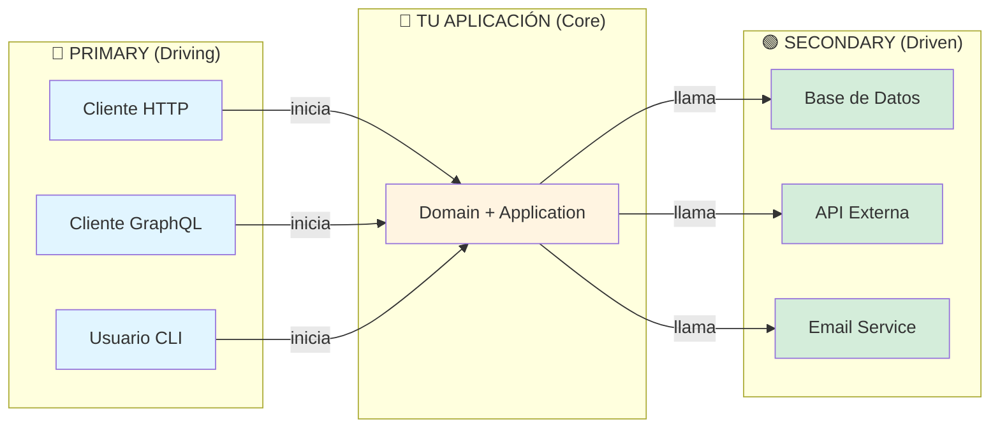

# 🔵🟢 Primary vs Secondary Adapters - Explicación Visual

## 🤔 ¿Qué significan Primary y Secondary?

En la arquitectura hexagonal, los adaptadores se dividen en **dos tipos** según su dirección de comunicación:

---

## 🔵 Primary Adapters (Adaptadores Primarios)

### También conocidos como:
- **Driving Adapters** (Adaptadores Conductores)
- **Inbound Adapters** (Adaptadores de Entrada)
- **Input Adapters**

### ¿Qué son?

Son los adaptadores que **CONDUCEN** o **INICIAN** la comunicación con tu aplicación.

### Pregunta clave: 
**"¿QUIÉN usa mi aplicación?"**

### Características:
- ✅ **Inician** la comunicación
- ✅ **Llaman** a tu aplicación
- ✅ Son el **punto de entrada**
- ✅ Dependen de **puertos de entrada** (interfaces de servicios)

### Ejemplos:
```
Usuario/Sistema Externo  ──────►  Tu Aplicación
                         (inicia)
```

| Tipo | Descripción | Ejemplo |
|------|-------------|---------|
| **REST API** | Cliente HTTP hace petición | `GET /api/weatherforecast` |
| **GraphQL** | Cliente GraphQL hace query | `query { forecasts }` |
| **gRPC** | Cliente gRPC llama servicio | `GetForecasts()` |
| **CLI** | Usuario ejecuta comando | `dotnet run -- forecast` |
| **Message Queue Consumer** | Escucha mensajes de cola | RabbitMQ, Kafka |
| **WebSocket** | Cliente se conecta vía WS | Chat en tiempo real |
| **Scheduled Jobs** | Cron/Timer ejecuta tarea | Background jobs |

### Código de Ejemplo:

```csharp
// Adapters/Primary/Rest/Controllers/WeatherForecastController.cs
namespace AspNetProject.Adapters.Primary.Rest.Controllers;

[ApiController]
[Route("api/[controller]")]
public class WeatherForecastController : ControllerBase
{
    private readonly IWeatherForecastService _service; // ← Puerto de ENTRADA
    
    [HttpGet]
    public ActionResult<IEnumerable<WeatherForecast>> Get([FromQuery] int days = 5)
    {
        // El CLIENTE inicia la comunicación (HTTP Request)
        // El controller CONDUCE la aplicación llamando al servicio
        var forecasts = _service.GetForecasts(days);
        return Ok(forecasts);
    }
}
```

---

## 🟢 Secondary Adapters (Adaptadores Secundarios)

### También conocidos como:
- **Driven Adapters** (Adaptadores Conducidos)
- **Outbound Adapters** (Adaptadores de Salida)
- **Output Adapters**

### ¿Qué son?

Son los adaptadores que **SON CONDUCIDOS** por tu aplicación. Tu aplicación los **LLAMA**.

### Pregunta clave:
**"¿QUÉ usa mi aplicación?"**

### Características:
- ✅ **Responden** a llamadas de tu aplicación
- ✅ Son **llamados** por tu aplicación
- ✅ Son **implementaciones** de puertos de salida
- ✅ Dependen de **puertos de salida** (interfaces de repositorios, providers)

### Ejemplos:
```
Tu Aplicación  ──────►  Sistema Externo/Infraestructura
               (llama)
```

| Tipo | Descripción | Ejemplo |
|------|-------------|---------|
| **Database Repository** | Tu app guarda/lee datos | PostgreSQL, MongoDB |
| **HTTP Client** | Tu app llama API externa | OpenWeatherMap API |
| **Email Sender** | Tu app envía emails | SMTP, SendGrid |
| **File Storage** | Tu app guarda archivos | AWS S3, Azure Blob |
| **Cache Provider** | Tu app cachea datos | Redis, Memcached |
| **Message Queue Publisher** | Tu app publica mensajes | RabbitMQ, Kafka |
| **SMS Sender** | Tu app envía SMS | Twilio |

### Código de Ejemplo:

```csharp
// Infrastructure/Providers/RandomWeatherForecastProvider.cs
namespace AspNetProject.Infrastructure.Providers;

public class RandomWeatherForecastProvider : IWeatherForecastProvider // ← Puerto de SALIDA
{
    public IEnumerable<WeatherForecast> GetForecasts(int days)
    {
        // La APLICACIÓN llama a este método
        // Este adaptador ES CONDUCIDO por la aplicación
        return GenerateRandomForecasts(days);
    }
}
```

---

## 📊 Comparación Visual



---

## 🎯 Flujo Completo de una Petición

```
┌─────────────────────────────────────────────────────────────────┐
│                    FLUJO DE UNA PETICIÓN                        │
└─────────────────────────────────────────────────────────────────┘

1. 🔵 PRIMARY ADAPTER (Driving)
   │
   │  Cliente HTTP hace: GET /api/weatherforecast?days=5
   │
   ▼
   WeatherForecastController (Adapters/Primary/Rest/)
   │
   │  controller.Get(days: 5)
   │
   ▼
   
2. 💎 DOMAIN (Core)
   │
   │  IWeatherForecastService (Puerto de Entrada)
   │
   ▼
   
3. 📋 APPLICATION (Use Case)
   │
   │  WeatherForecastService.GetForecasts(5)
   │  - Valida que days esté entre 1 y 30
   │  - Llama al provider
   │
   ▼
   
4. 💎 DOMAIN (Core)
   │
   │  IWeatherForecastProvider (Puerto de Salida)
   │
   ▼
   
5. 🟢 SECONDARY ADAPTER (Driven)
   │
   │  RandomWeatherForecastProvider (Infrastructure/)
   │  - Genera datos aleatorios
   │  - Retorna List<WeatherForecast>
   │
   ▼
   
6. Respuesta viaja de vuelta al cliente
```

---

## 🔄 Analogía del Mundo Real

### 🔵 Primary (Driving) = **Clientes del Restaurante**

Los clientes **inician** la interacción:
- Entran al restaurante
- Hacen un pedido
- Esperan la comida

**Ejemplos en código:**
- REST Controller = Mesero que toma el pedido
- GraphQL Resolver = Mesero especializado
- CLI = Servicio a domicilio

### 🟢 Secondary (Driven) = **Proveedores del Restaurante**

El restaurante **llama** a los proveedores cuando los necesita:
- Llama al proveedor de verduras
- Llama al proveedor de carne
- Llama al servicio de limpieza

**Ejemplos en código:**
- Repository = Almacén de ingredientes (base de datos)
- HTTP Client = Proveedor externo (API)
- Email Sender = Servicio de mensajería

---

## 📁 Estructura en el Proyecto

```
AspNetProject/
│
├── Adapters/
│   │
│   ├── Primary/              🔵 DRIVING (Quién usa mi app)
│   │   ├── Rest/            ← Cliente HTTP inicia petición
│   │   ├── GraphQL/         ← Cliente GraphQL inicia query
│   │   ├── Grpc/            ← Cliente gRPC inicia llamada
│   │   └── Cli/             ← Usuario inicia comando
│   │
│   └── Secondary/            🟢 DRIVEN (Qué usa mi app)
│       └── (opcional)       ← Casos específicos
│
└── Infrastructure/           🟢 DRIVEN (Principalmente aquí)
    ├── Repositories/        ← Mi app llama a la BD
    ├── Providers/           ← Mi app llama a servicios
    └── EmailSenders/        ← Mi app envía emails
```

---

## ❓ Preguntas Frecuentes

### ¿Por qué no veo Secondary en Adapters/?

**Respuesta:** En .NET (y muchos frameworks), los adaptadores secundarios tradicionalmente van en `Infrastructure/` porque son detalles de infraestructura. La carpeta `Adapters/Secondary/` es **opcional** y solo se usa si quieres una separación más explícita.

**Ambas son válidas:**

```
Opción 1 (Más común en .NET):
├── Adapters/Primary/
└── Infrastructure/  (adaptadores secundarios aquí)

Opción 2 (Más explícita):
├── Adapters/
│   ├── Primary/
│   └── Secondary/
└── Infrastructure/  (solo DbContext, configuraciones)
```

### ¿Cómo sé si mi adaptador es Primary o Secondary?

**Pregúntate:**

1. **¿Quién inicia la comunicación?**
   - Si es **externo → tu app**: Primary
   - Si es **tu app → externo**: Secondary

2. **¿Qué puerto implementa?**
   - Si implementa un **servicio** (IWeatherForecastService): Primary
   - Si implementa un **provider/repository** (IWeatherForecastProvider): Secondary

### ¿Puede un adaptador ser ambos?

**Generalmente NO**, pero hay casos especiales:

**Ejemplo:** Message Queue
- **Consumer** (escucha mensajes): Primary
- **Publisher** (publica mensajes): Secondary

Se separan en dos adaptadores diferentes.

---

## 📚 Terminología en Diferentes Fuentes

| Concepto | Nombres Alternativos |
|----------|---------------------|
| **Primary** | Driving, Inbound, Input, Left-side |
| **Secondary** | Driven, Outbound, Output, Right-side |

---

## 🎓 Ejemplo Completo

### Primary Adapter (REST)

```csharp
// Adapters/Primary/Rest/Controllers/WeatherForecastController.cs
// DRIVING: El cliente HTTP CONDUCE la aplicación

[ApiController]
[Route("api/[controller]")]
public class WeatherForecastController : ControllerBase
{
    private readonly IWeatherForecastService _service; // Puerto de ENTRADA
    
    [HttpGet]
    public ActionResult<IEnumerable<WeatherForecast>> Get(int days)
    {
        // 1. Cliente inicia petición HTTP
        // 2. Controller llama al servicio
        var forecasts = _service.GetForecasts(days);
        return Ok(forecasts);
    }
}
```

### Application Service

```csharp
// Application/Services/WeatherForecastService.cs
// CORE: Orquesta la lógica de negocio

public class WeatherForecastService : IWeatherForecastService
{
    private readonly IWeatherForecastProvider _provider; // Puerto de SALIDA
    
    public IEnumerable<WeatherForecast> GetForecasts(int days)
    {
        // 3. Valida lógica de negocio
        if (days < 1 || days > 30)
            throw new ArgumentException("Days must be between 1 and 30");
        
        // 4. Llama al adaptador secundario
        return _provider.GetForecasts(days);
    }
}
```

### Secondary Adapter (Provider)

```csharp
// Infrastructure/Providers/RandomWeatherForecastProvider.cs
// DRIVEN: ES CONDUCIDO por la aplicación

public class RandomWeatherForecastProvider : IWeatherForecastProvider
{
    public IEnumerable<WeatherForecast> GetForecasts(int days)
    {
        // 5. Genera datos (podría ser BD, API externa, etc.)
        // 6. Retorna datos a la aplicación
        return GenerateRandomForecasts(days);
    }
}
```

---

## ✅ Resumen

| Aspecto | Primary (Driving) 🔵 | Secondary (Driven) 🟢 |
|---------|---------------------|----------------------|
| **Dirección** | Externo → Tu App | Tu App → Externo |
| **Inicia** | Ellos te llaman | Tú los llamas |
| **Pregunta** | ¿Quién usa mi app? | ¿Qué usa mi app? |
| **Puerto** | Entrada (Service) | Salida (Provider/Repository) |
| **Ubicación** | `Adapters/Primary/` | `Infrastructure/` o `Adapters/Secondary/` |
| **Ejemplos** | REST, GraphQL, CLI | Database, Email, HTTP Client |

---

## 🎯 Regla Nemotécnica

```
PRIMARY = PRIMERO en iniciar
          ↓
    (Cliente te llama)

SECONDARY = SEGUNDO en responder
            ↓
      (Tú llamas a servicios)
```

---

**¿Tiene sentido ahora?** 🚀

La separación Primary/Secondary es clave para entender el flujo de datos en arquitectura hexagonal. No es solo organización de carpetas, es un **concepto arquitectónico fundamental**.
