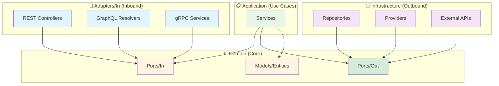

# 📁 Estructura del Proyecto - Arquitectura Hexagonal

## Vista General

```
AspNetProject/
├── Adapters/                    🔌 Capa de Adaptadores
│   ├── In/                      🔵 Adaptadores de Entrada (Inbound)
│   │   └── Rest/               
│   │       └── Controllers/     
│   │           └── WeatherForecastController.cs
│   ├── Out/                     🟢 Adaptadores de Salida (Outbound)
│   │   └── (futuro)            
│   └── README.md               
│
├── Domain/                      💎 Capa de Dominio (Core)
│   ├── Models/                  
│   │   ├── City.cs             
│   │   ├── IEntity.cs          
│   │   └── WeatherForecast.cs  
│   └── Ports/                   🔌 Puertos (Interfaces)
│       ├── In/                  🔵 Puertos de Entrada
│       │   └── IWeatherForecastService.cs
│       ├── Out/                 🟢 Puertos de Salida
│       │   ├── IRepository.cs
│       │   └── IWeatherForecastProvider.cs
│       └── README.md
│
├── Application/                 📋 Capa de Aplicación (Use Cases)
│   └── Services/               
│       └── WeatherForecastService.cs
│
└── Infrastructure/              🔧 Capa de Infraestructura
    ├── Data/                    
    │   ├── ApplicationDbContext.cs
    │   └── Configurations/     
    │       └── CityConfiguration.cs
    ├── Providers/              
    │   └── RandomWeatherForecastProvider.cs
    └── Repositories/           
        ├── EfRepository.cs     
        └── CityRepository.cs   
```

## Flujo de Dependencias



## Descripción de Capas

### 🔵 Adapters/In (Adaptadores de Entrada)

**Propósito**: Puntos de entrada a la aplicación. Reciben peticiones externas.

**Contiene**:
- REST Controllers (HTTP/JSON)
- GraphQL Resolvers
- gRPC Services
- CLI Commands
- Message Queue Consumers

**Dependencias**: 
- ✅ Depende de `Domain/Ports/In/` (puertos de entrada)
- ❌ NO depende de `Infrastructure`
- ❌ NO depende de `Adapters/Out/`

**Ejemplo**:
```csharp
// Adapters/In/Rest/Controllers/WeatherForecastController.cs
public class WeatherForecastController : ControllerBase
{
    private readonly IWeatherForecastService _service; // Puerto IN
}
```

---

### 💎 Domain (Núcleo/Core)

**Propósito**: Contiene la lógica de negocio pura y las abstracciones.

**Contiene**:
- **Models**: Entidades de dominio (`City`, `WeatherForecast`, `IEntity<T>`)
- **Ports/In**: Puertos de entrada - casos de uso (`IWeatherForecastService`)
- **Ports/Out**: Puertos de salida - dependencias (`IRepository<T>`, `IWeatherForecastProvider`)

**Dependencias**: 
- ❌ NO depende de NINGUNA otra capa
- ✅ Es el centro de la arquitectura

**Ejemplo**:
```csharp
// Domain/Ports/In/IWeatherForecastService.cs
public interface IWeatherForecastService
{
    IEnumerable<WeatherForecast> GetForecasts(int days);
}

// Domain/Ports/Out/IWeatherForecastProvider.cs
public interface IWeatherForecastProvider
{
    IEnumerable<WeatherForecast> GetForecasts(int days);
}
```

---

### 📋 Application (Casos de Uso)

**Propósito**: Implementa la lógica de negocio y orquesta el flujo de datos.

**Contiene**:
- Services que implementan casos de uso
- DTOs (Data Transfer Objects)
- Validaciones de negocio

**Dependencias**: 
- ✅ Implementa `Domain/Ports/In/` (puertos de entrada)
- ✅ Usa `Domain/Ports/Out/` (puertos de salida)
- ✅ Usa `Domain/Models` (entidades)
- ❌ NO depende de `Infrastructure`
- ❌ NO depende de `Adapters`

**Ejemplo**:
```csharp
// Application/Services/WeatherForecastService.cs
public class WeatherForecastService : IWeatherForecastService  // Implementa puerto IN
{
    private readonly IWeatherForecastProvider _provider; // Usa puerto OUT
    
    public IEnumerable<WeatherForecast> GetForecasts(int days)
    {
        // Lógica de negocio
        if (days < 1 || days > 30)
            throw new ArgumentException("Days must be between 1 and 30");
            
        return _provider.GetForecasts(days);
    }
}
```

---

### 🔧 Infrastructure (Adaptadores de Salida)

**Propósito**: Implementa los detalles técnicos y adaptadores de salida.

**Contiene**:
- **Data**: DbContext, Configurations de EF Core
- **Repositories**: Implementaciones de `IRepository<T>`
- **Providers**: Implementaciones de servicios externos
- **External APIs**: Clientes HTTP, integraciones

**Dependencias**: 
- ✅ Implementa `Domain/Ports/Out/` (puertos de salida)
- ✅ Usa `Domain/Models` (entidades)
- ❌ NO depende de `Adapters`
- ❌ NO depende de `Application`

**Ejemplo**:
```csharp
// Infrastructure/Providers/RandomWeatherForecastProvider.cs
public class RandomWeatherForecastProvider : IWeatherForecastProvider  // Implementa puerto OUT
{
    public IEnumerable<WeatherForecast> GetForecasts(int days)
    {
        // Implementación específica de infraestructura
        return GenerateRandomData(days);
    }
}
```

---

## Reglas de Oro 🎯

### ✅ Permitido

1. **Adapters/In** → **Domain/Ports/In** ✅
2. **Application** → **Domain/Ports/In** (implementa) ✅
3. **Application** → **Domain/Ports/Out** (usa) ✅
4. **Infrastructure** → **Domain/Ports/Out** (implementa) ✅
5. **Cualquier capa** → **Domain/Models** ✅

### ❌ Prohibido

1. **Domain** → **Cualquier otra capa** ❌
2. **Application** → **Infrastructure** ❌
3. **Application** → **Adapters** ❌
4. **Adapters/In** → **Infrastructure** ❌
5. **Adapters/In** → **Adapters/Out** ❌

---

## Flujo Completo de una Petición

```
1. Cliente HTTP hace petición
   ↓
2. WeatherForecastController (Adapters/In/Rest)
   ↓
3. IWeatherForecastService (Domain/Ports/In)
   ↓
4. WeatherForecastService (Application) - implementa puerto IN
   ↓
5. IWeatherForecastProvider (Domain/Ports/Out)
   ↓
6. RandomWeatherForecastProvider (Infrastructure) - implementa puerto OUT
   ↓
7. Retorna WeatherForecast (Domain/Models)
   ↓
8. Respuesta HTTP al cliente
```

---

## Comparación de Nomenclaturas

| Este Proyecto | Alternativas |
|---------------|--------------|
| `Adapters/In/` | Primary, Driving, Inbound, Input |
| `Adapters/Out/` | Secondary, Driven, Outbound, Output |
| `Domain/Ports/In/` | UseCases, Application Ports, Input Ports |
| `Domain/Ports/Out/` | SPI, Infrastructure Ports, Output Ports |

**Elegimos In/Out porque es más claro y directo.**

---

## Ventajas de esta Estructura

| Ventaja | Descripción |
|---------|-------------|
| **Testabilidad** | Fácil crear mocks de puertos |
| **Flexibilidad** | Cambiar tecnologías sin afectar el core |
| **Mantenibilidad** | Cambios aislados en cada capa |
| **Escalabilidad** | Agregar funcionalidad sin romper lo existente |
| **Claridad** | Separación explícita In/Out |

---

## Próximos Pasos

Para agregar nuevas funcionalidades:

1. **Definir puerto IN** en `Domain/Ports/In/` (caso de uso)
2. **Definir puertos OUT** en `Domain/Ports/Out/` (dependencias)
3. **Crear entidad** en `Domain/Models/` (si es necesario)
4. **Implementar servicio** en `Application/Services/` (implementa IN, usa OUT)
5. **Implementar adaptadores OUT** en `Infrastructure/` (implementan puertos OUT)
6. **Exponer vía adaptador IN** en `Adapters/In/Rest/Controllers/`

Ver [EXTENSION_GUIDE.md](../../EXTENSION_GUIDE.md) para ejemplos detallados.
